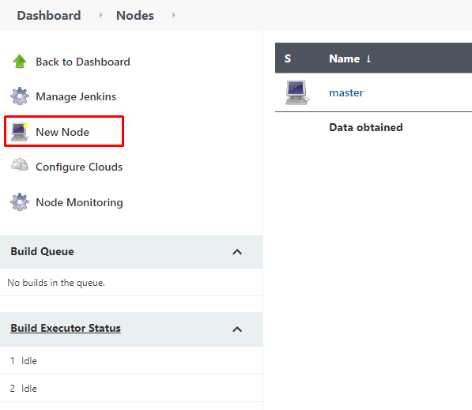
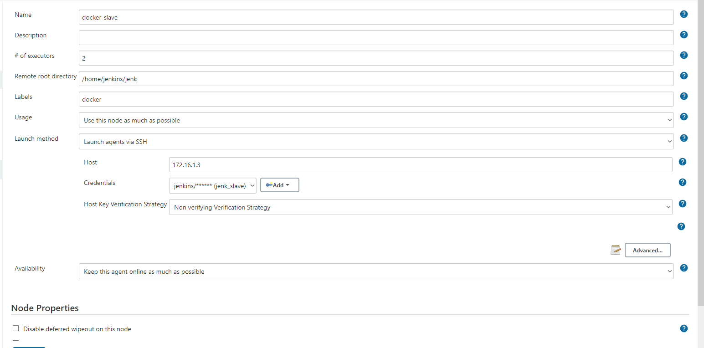
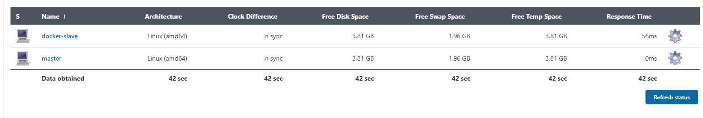

My configuration for Jenkins and Selenium environment.    
Configuration contains:

* Jenkins,
* Jenkins Node,
* Selenium Grid (hub and two Chrome nodes) for executing E2E tests.

# Installation

In order to start environment:

1. Clone this repository using ``git clone https://github.com/miloszhoc/jenkins-env.git ``.
2. Make sure you have installed docker and docker-compose on your machine.
3. cd into jenkins-env directory.
4. run `` docker-compose up -d `` command.
5. When containers are up open Jenkins' website.
6. Register your account.
7. To add new node go to: dashboard -> manage Jenkins -> Manage Nodes and Clouds -> New Node.   
   
8. Set the node name and check "Permanent Agent" checkbox.
   

9. In next step define:
* \# of executors,
* Remote root directory (in my case it's ``/home/jenkins/jenk`` - you can change it in dockerfile)
* Labels (in my case - docker)
* Launch method - Launch agent via SSH
* Host - 172.16.1.3 (you can change it in docker-compose)
* Credentials - `` jenkins:jenkins_password `` (you can change it in dockerfile)
* Host Key Verification Strategy - Non verifying Verification Strategy   
  

10. After you save configuration you should see new working node on the list.   
    

# Additional info

Selenium Hub is available under 4444 port. Jenkins is available under 8080 port.   
If you want to see details about containers network addresses check docker-compose.yml file.   
If you want to change credentials of Jenkins node container check Dockerfile.
